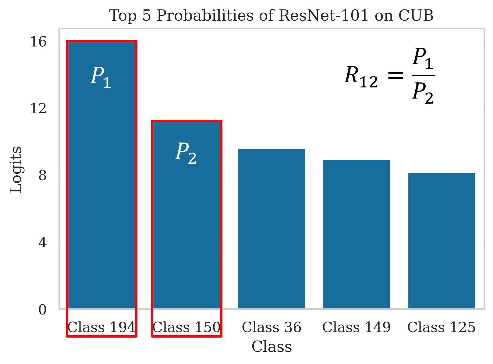
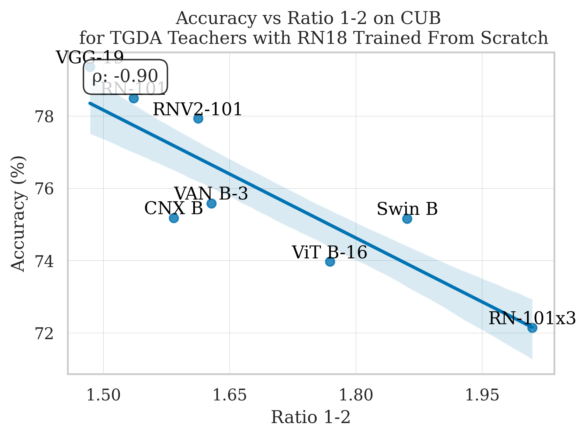
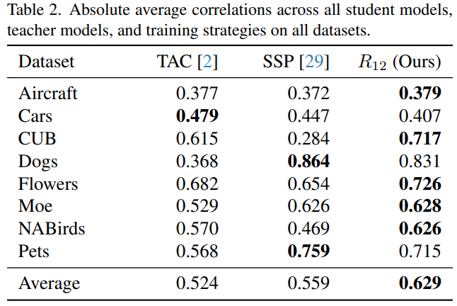

# How to Choose Your Teacher for Fine Grained Image Recognition

Official PyTorch code for the paper: [How to Choose Your Teacher for Fine Grained Image Recognition](https://arxiv.org/abs/2605.15689), published at the Fine-Grained Visual Categorization (FGVC13) Workshop @ CVPR 2026.

This paper introduces a teacher selection metric, Ratio 1-2, based on teacher prediction ratios.



Our proposed metric demonstrates a strong correlation with the resulting student performance during knowledge distillation.



Extensive experiments across eight fine-grained image recognition (FGIR) datasets show that our method consistently achieves favorable results.



## Setup
```
pip install -e . 
```

## Preparation

Datasets are downloaded from:
```
Xiaohan Yu, Yang Zhao, Yongsheng Gao, Xiaohui Yuan, Shengwu Xiong (2021). Benchmark Platform for Ultra-Fine-Grained Visual Categorization BeyondHuman Performance. In ICCV2021.
https://github.com/XiaohanYu-GU/Ultra-FGVC?tab=readme-ov-file
```

Visualize with:

```
python -u tools/postprocess/vis_dfsm.py --cfg configs/cub_weakaugs.yaml --debugging --batch_size 12 --vis_cols 12
```

To visualize a specific class add: ` --vis_class {CLASS_ID}`.

## Train

To train a `levit_128s` on aircraft using image size 224 for teacher and image size 224 for student:

```
python -u tools/train_student.py --project_name KD_ST_Others --square_resize_random_crop --test_square_resize_center_crop --cpu_workers 28 --cfg configs/aircraft_weakaugs.yaml --model_name levit_128s --model_name_teacher vit_b16 --ckpt_path_teacher ../../results_backbones/fz_ckpts/aircraft_vit_b16_fz.pth --epochs 1 --opt adamw --weight_decay 5e-2 --lr 5e-3 --temp 2 --loss_kd_weight 10 --compute_train_wise_teacher_metrics --serial 999
```

more examples of how to run the code may can be seen in scripts/sample.sh


# Citation
If you find our work helpful in your research, please cite it as:

```
@misc{gosal_how_2026,
    title = {How to {Choose} {Your} {Teacher} for {Fine} {Grained} {Image} {Recognition}},
    copyright = {arXiv.org perpetual, non-exclusive license},
    url = {https://arxiv.org/abs/2605.15689},
    doi = {10.48550/ARXIV.2605.15689},
    abstract = {Fine-grained image recognition classifies subcategories such as bird species or car models. While state-of-the-art (SOTA) models are accurate, they are often too resource-intensive for deployment on constrained devices. Knowledge distillation addresses this by transferring knowledge from a large teacher model to a smaller student model. A key challenge is selecting the right teacher, as it heavily impacts student performance. This paper introduces a teacher selection metric, {\textbackslash}textbf\{Ratio 1-2\}, based on teacher prediction ratios. Extensive analysis of over one thousand experiments across 3 students, 8 teachers, and 8 datasets under 4 training strategies demonstrates that our metric improves teacher selection by 18{\textbackslash}\% over previous methods, enabling small student models to achieve up to 17{\textbackslash}\% accuracy gains. Experiment codebase is available at: {\textbackslash}href\{https://github.com/arkel23/FGIR-KD-Teacher\}\{https://github.com/arkel23/FGIR-KD-Teacher\}.},
    urldate = {2026-05-18},
    publisher = {arXiv},
    author = {Gosal, Oswin and Rios, Edwin Arkel and Surya, Augusto Christian and Mikael, Fernando and Lai, Bo-Cheng and Hu, Min-Chun},
    year = {2026},
    note = {Version Number: 1},
    keywords = {FOS: Computer and information sciences, Computer Vision and Pattern Recognition (cs.CV), I.2; I.4},
}

```

# Acknowledgements
We thank NYCU's HPC Center and National Center for High-performance Computing (NCHC) for providing computational and storage resources. 

We thank the authors of [CAL](https://github.com/raoyongming/CAL), and [timm](https://github.com/huggingface/pytorch-image-models/) for their code we used as foundation.

Also, [Weight and Biases](https://wandb.ai/) for their platform for experiment management.
 
